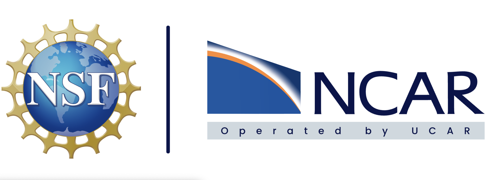

# Helping Scientists Embrace their Inner Research Software Engineer (RSE) and Working Together with the Community Earth System Model (CESM) RSEs to improve CESM Science

**Authors**: [Erik Kluzek](mailto:erik@ucar.edu)

NSF-NCAR (National Science Foundation-National Center for Atmospheric Research), PO Box 3000, Boulder CO 80037-3000

**Abstract**: The Community Earth System Model (CESM) is science expressed in Software, which means everyone who touches CESM code to work on the science -- is doing RSE work. There is a list of challenges that CESM RSE’s have with both bringing in new science for CESM and ensuring CESM is well tested, robust, flexible as well as having the correct science. As such CESM Scientists working in CESM code need to work alongside CESM RSE’s to adopt RSE practices while their science is being developed. For CESM to be useful for scientists it needs to be: well-tested, robust, reproducible, flexible and have assurance that the science is implemented correctly. This is needed both for the science and the software of CESM. Helping  scientists embrace their inner RSE is an effort to keep CESM as a leading model in Earth System Science research, by having more people who work with the CESM code adopt good coding practices. In this talk I will specifically talk about RSE practices for the Land Model component of CESM, the Community Terrestrial Science Mode (CTSM)l. I will present on the RSE challenges we have in CTSM and how to solve them we need to involve and educate CTSM scientists to improve our RSE practices. I will also present regarding the CTSM RSE team’s efforts to educate the scientists and on some improvements to our RSE practices that we’ve been implementing on our CTSM Software Development.

**Keywords:** Research-Software-Engineering, Software-Development-Methods, CESM, CTSM, Earth-System-Model, Land-Model

**Acknowledgements**: I want to point out the great CTSM SE team that I am proud to be a part of: Adrianna Foster, Greg Lemieux, Ryan Knox, Sam Levis, Sam Rabin, Will Wieder can be reached at [ctsm-software](mailto:ctsm-software@ucar.edu)
  
